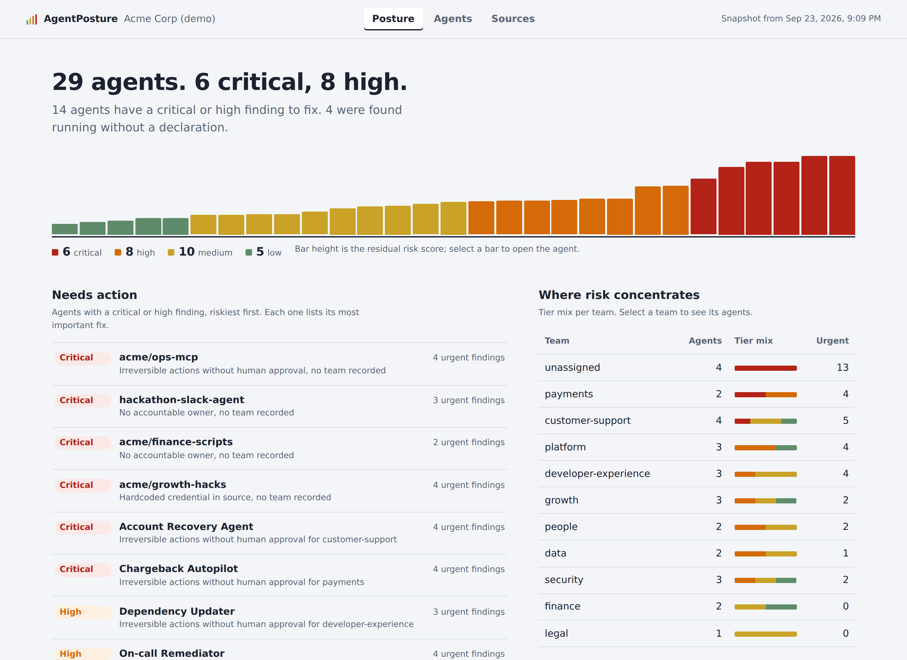
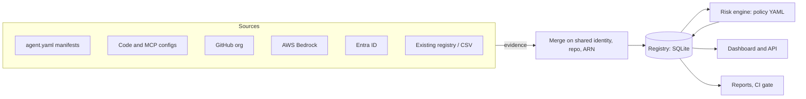
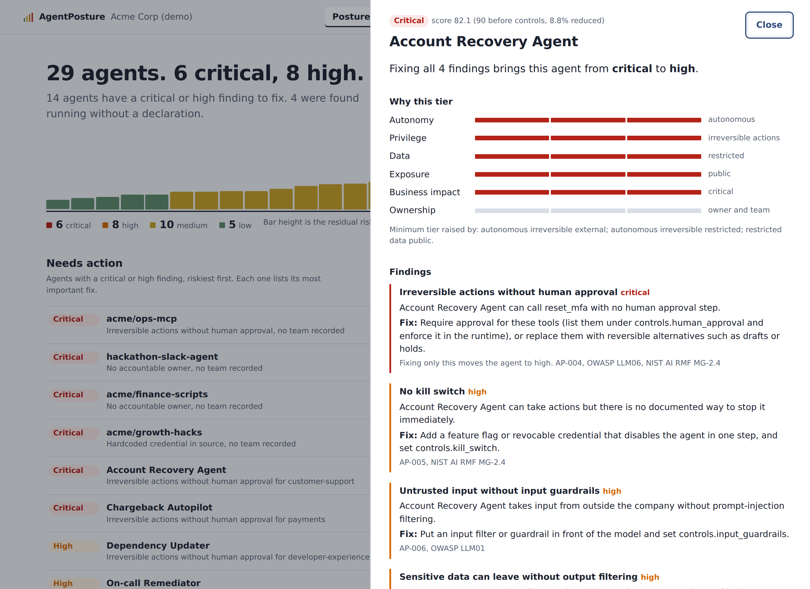

# AgentPosture

**Find every AI agent in your organization and know how risky each one is.**

AgentPosture connects to the places agents live (your code, your cloud AI platforms, your
identity provider, your existing registries), builds one inventory, scores every agent against a
transparent risk policy, and shows the result in a dashboard for leadership and a to-do list for
each agent's owner.

It is a single Python package with one dependency, a SQLite file for storage, and no build step.
You can try it in one command and run it in production with one config file.



The sample dashboard in [examples/sample-dashboard/](examples/sample-dashboard/) is one
self-contained HTML file: download `index.html` and open it, or enable GitHub Pages on this
repository to browse it online. The same folder has the [Markdown report](examples/sample-dashboard/report.md)
and [CSV export](examples/sample-dashboard/agents.csv) generated from the same data.

---

## Try it in 60 seconds

```bash
pipx install git+https://github.com/xamitgupta/agentposture   # or: pip install agentposture
agentposture demo                                                     # opens a sample organization on http://localhost:8484
```

Or with Docker:

```bash
git clone https://github.com/xamitgupta/agentposture && cd agentposture
docker compose up                                                     # http://localhost:8484
```

The demo is a 29-agent company with the problems a real first scan finds: agents nobody declared,
agents running with more permission than they claim, irreversible actions with no human approval,
and a hardcoded API key.

## Use it on your organization

```bash
agentposture init --org "Acme Corp"      # writes agentposture.yaml and an example agent.yaml
agentposture scan                        # discover, merge, score
agentposture serve                       # dashboard + API + scheduler on http://localhost:8484
```

The starter config scans the current directory for `agent.yaml` manifests and for agent code.
Uncomment the GitHub, AWS Bedrock, or Entra ID sections to add those sources. Every credential is
read-only and comes from an environment variable.

## What it answers

| Who | Question | Where |
|---|---|---|
| CISO, risk committee | How many agents do we have, how many are critical, is it getting better? | Posture view, `agentposture report` |
| Security and GRC | Which agents are undeclared, unowned, or running with more than they declared? | Inventory health, Agents filters |
| Platform teams | Which fix removes the most risk across all agents? | Most common findings, Controls in place |
| Agent owners | Why is my agent High, and what exactly do I change to lower it? | Agent detail, `agentposture show <id>` |
| Engineers in CI | Will this agent.yaml pass the bar before it merges? | `agentposture check`, the GitHub Action |

## How it works



1. **Collect.** Each connector yields *evidence* about agents it can see. Owners *declare* agents in
   an `agent.yaml`; discovery connectors *observe* what is actually running.
2. **Merge.** Evidence that shares a join key (an agent id, a service principal, a repository, a
   cloud ARN) becomes one agent. For every risk attribute the riskier of declared and observed wins,
   and any gap is recorded as **drift**. An observed agent with no declaration is a **shadow agent**.
3. **Score.** Six dimensions (autonomy, privilege, data sensitivity, exposure, business impact,
   ownership) give an inherent score. Controls that are in place and relevant reduce it to a
   residual score, which sets the tier. Overrides raise the minimum tier for dangerous combinations,
   such as an autonomous agent with irreversible tools facing the public.
4. **Explain.** Every finding carries a remediation, a framework mapping (NIST AI RMF, OWASP Top 10
   for LLM Applications, CWE), and the tier the agent would reach if only that finding were fixed.
5. **Keep current.** Each source runs on its own cron schedule, on a signed webhook, or on demand.
   Agents are reassessed the moment their attributes change, whenever the policy changes, and at
   least every *N* days by tier (critical daily, low quarterly by default).

Read [docs/architecture.md](docs/architecture.md) for the full design.

Each agent's owner gets the reasons behind the tier and a ranked list of fixes, with the tier each
fix would reach:



## Declaring an agent

Put this next to the agent's code. Only `id` is required; everything you leave out is scored as
risky until someone fills it in.

```yaml
id: refund-assistant
name: Refund Assistant
owner: priya@acme.example
team: payments
lifecycle: production
business_impact: high           # low | medium | high | critical
autonomy: act_with_approval     # read_only | recommend | act_with_approval | autonomous
exposure: customer              # internal | partner | customer | public
data: {sensitivity: confidential, types: [pii, financial]}
tools:
  - {name: lookup_order, action: read}
  - {name: issue_refund, action: irreversible, requires_approval: true}
controls: {kill_switch: true, audit_logging: true, input_guardrails: true, output_guardrails: true}
```

Full reference: [docs/manifest.md](docs/manifest.md). JSON Schema for editor completion:
[schemas/agent-manifest.schema.json](schemas/agent-manifest.schema.json).

## Gate risky agents in pull requests

```yaml
# .github/workflows/agent-risk-gate.yml
on: {pull_request: {paths: ["**/agent.yaml"]}}
jobs:
  check:
    runs-on: ubuntu-latest
    steps:
      - uses: actions/checkout@v4
      - uses: xamitgupta/agentposture@v1
        with: {fail-on: high}
```

Or anywhere else: `agentposture check path/to/agents --fail-on high`. It needs no server and no database.

## Connectors

| Type | Finds | Needs |
|---|---|---|
| `manifest` | Declared agents in `agent.yaml` files | Read access to the files |
| `code_scan` | Agent frameworks, tools, MCP servers, approval hints and hardcoded keys in local code | Read access to checkouts |
| `github` | Both of the above across a GitHub organization | Token with Contents: read |
| `aws_bedrock` | Bedrock agents, action groups, guardrails, IAM role permissions | Read-only IAM (listed in docs) |
| `entra_id` | Agent service principals, their API permissions, owners and credential type | `Application.Read.All` |
| `http_json` | Any JSON API or file: internal registries, Backstage, CMDB exports | Whatever the API needs |
| `csv` | A spreadsheet inventory | The file |
| `demo` | A sample organization | Nothing |

Adding a connector is one class with one method; see [docs/writing-a-connector.md](docs/writing-a-connector.md).
Third-party connectors install as ordinary Python packages and are picked up automatically.

## Command reference

| Command | What it does |
|---|---|
| `agentposture init` | Create a starter `agentposture.yaml` and example manifest |
| `agentposture validate` | Check the config, the policy and every local source |
| `agentposture scan [--source NAME]` | Scan now and reassess |
| `agentposture list [--tier high] [--flag shadow]` | Agents, riskiest first |
| `agentposture show ID` | One agent's tier, the reasons, and the fixes |
| `agentposture serve` | Dashboard, REST API and scheduler |
| `agentposture report -f html\|md\|csv\|json -o FILE` | Export for leadership, audits or other tools |
| `agentposture check PATHS --fail-on TIER` | CI gate for manifests |
| `agentposture policy -o policy.yaml` | Copy the default policy to customize it |
| `agentposture connectors` | List source types (add `-v` for their options) |
| `agentposture demo [--out DIR]` | Sample organization, live or as static files |

## Documentation

- [Architecture](docs/architecture.md): components, data flow, design decisions
- [Configuration](docs/configuration.md): every key in `agentposture.yaml`, cadence and reassessment
- [Agent manifest](docs/manifest.md): the `agent.yaml` reference
- [Connectors](docs/connectors.md): setup and least-privilege permissions for each source
- [Scoring and policy](docs/scoring.md): the risk model, tiers, overrides, findings, framework mapping
- [Deployment](docs/deployment.md): Docker, Kubernetes, systemd, SSO, backups
- [API](docs/api.md): REST endpoints and webhooks
- [Security](docs/security.md): how AgentPosture protects the data it holds
- [Writing a connector](docs/writing-a-connector.md)
- [FAQ](docs/faq.md)

## Design principles

- **Simple to adopt.** One command to see it, one file to configure it, one SQLite file to back up.
  The only runtime dependency is PyYAML.
- **Conservative by default.** Unknown is scored as risky. Declared-versus-observed conflicts resolve
  to the riskier value. Nothing is assumed safe because nobody said otherwise.
- **Explainable.** Every tier traces to attributes and policy lines. The policy is a YAML file you
  can read, diff, and review like code.
- **Read-only.** AgentPosture never changes the systems it scans.

## Contributing

Issues and pull requests are welcome. See [CONTRIBUTING.md](CONTRIBUTING.md). Report security issues
privately as described in [SECURITY.md](SECURITY.md).

## License

Apache License 2.0. See [LICENSE](LICENSE).
