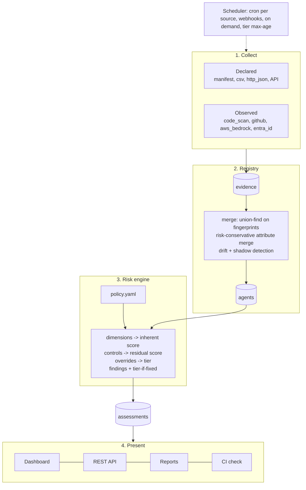

# Architecture

AgentPosture has four layers. Each has one job and talks to the next through a small, stable data
shape, so any layer can be extended without touching the others.



## The data model

Three records flow through the system (`src/agentposture/models.py`):

| Record | Produced by | Meaning |
|---|---|---|
| `Evidence` | a connector | One observation of one agent from one source. Has a `kind` (`declared` or `observed`), normalized `attributes`, and `fingerprints` (join keys). |
| `Agent` | the merge step | Everything known about one agent: effective attributes, what was declared, what was observed, drift, sources, first and last seen. |
| `Assessment` | the risk engine | Score, tier, dimension levels, controls coverage, overrides applied, findings, and the policy hash that produced it. |

### Normalized vocabulary

Every connector maps what it sees onto the same attributes (`normalize.py`), so the engine never
needs to know where a value came from. The ordinal scales, lowest risk first:

| Attribute | Levels |
|---|---|
| `autonomy` | read_only, recommend, act_with_approval, autonomous |
| `exposure` | internal, partner, customer, public |
| `data_sensitivity` | public, internal, confidential, restricted |
| `business_impact` | low, medium, high, critical |
| `privilege_level` | none, read, write, admin (derived from tools and privileges) |
| tool `action` | read, write, irreversible (declared, or inferred from the tool name) |

Aliases are accepted (`human_in_the_loop` becomes `act_with_approval`, `internet` becomes
`public`). A value that cannot be mapped is kept as `unknown:<value>` and scored as risky, so a typo
never makes an agent look safer.

## 1. Collect

A connector is a class with one method, `discover()`, that yields `Evidence`. It does not store,
deduplicate or score anything. There are two kinds:

- **Declared sources** capture what only the owner knows: business impact, data sensitivity,
  intended autonomy, which controls exist. The primary one is the `agent.yaml` manifest, which lives
  in the agent's repository and is reviewed like code.
- **Observed sources** capture what is actually true: which tools are wired up, which permissions the
  identity holds, which guardrails are configured, which agents exist that nobody declared.

Neither kind is trusted alone. The combination is what makes the inventory both complete and
accurate.

## 2. Registry and merge

After every scan the registry rebuilds agents from all current evidence (`merge.py`).

**Joining.** Evidence items are nodes; shared fingerprints are edges; each connected component is one
agent (union-find). Fingerprints include `id:<agent id>`, `repo:<owner/name>`,
`identity:<principal>`, `aws_bedrock:<arn>`. A manifest can add any of these under `links:`, and a
repository that contains exactly one manifest is linked to that repository automatically.

**Merging.** For each attribute:

| Attribute type | Rule |
|---|---|
| Identity fields (name, owner, team, lifecycle, business impact) | Declared wins; observed fills gaps |
| Risk ordinals (autonomy, exposure, data sensitivity, privilege) | The riskier of declared and observed |
| Lists (tools, privileges, data types) | Union; a tool keeps its riskiest classification |
| Controls | Declared claims, overwritten by observed facts where a source can see the control |

**Drift.** When an observed risk attribute exceeds the declaration (more autonomy, broader
privileges, tools that were not declared), the difference is stored on the agent and raised as a
finding. **Shadow agents** are agents with observed evidence and no declared evidence.

**Stale agents.** Evidence records when each source last saw an item. An agent no source has seen
for `stale_after` is flagged stale. Evidence older than three times `stale_after` (minimum 30 days)
is purged.

**Stable ids.** A declared agent uses its manifest `id`. A shadow agent gets a readable id derived
from its name and a hash of its first fingerprint, so it keeps the same id across scans.

## 3. Risk engine

`engine/scoring.py` applies a policy (`policies/default.yaml` unless you supply your own):

1. **Dimensions.** Six dimensions each get a level from 0 to 3. Unknown values take the policy's
   `unknown_level`, which defaults to the worst level.
2. **Inherent score.** The weighted average of the levels, scaled to 0-100.
3. **Residual score.** Controls that apply to this agent and are in place reduce the inherent score,
   by up to `max_reduction` percent (35 by default).
4. **Tier.** From the residual score and the policy thresholds.
5. **Overrides.** Conditions that force a minimum tier regardless of score. This is where blast
   radius lives: autonomy, irreversibility and public exposure together are worse than their average.
6. **Findings.** Conditions describing specific, fixable gaps, each with remediation text and
   framework references. For each finding the engine applies its `fix` to a copy of the facts and
   rescores, so an owner sees the tier that fixing it alone would produce, and the target tier with
   everything fixed.

The engine is a pure function of `(agent, policy)`. That makes it easy to test and means `check`
can run in CI with no database.

### When reassessment happens

| Trigger | Mechanism |
|---|---|
| An agent's attributes change | `on_change`: the agent's attribute hash differs from the one last assessed |
| The policy changes | The policy hash is stored; any change reassesses everything |
| Time passes | `max_age_by_tier`: critical daily, high weekly, medium monthly, low quarterly by default; checked hourly by the server |
| Someone asks | Scan button, `POST /api/scan`, `agentposture scan` |

Every assessment is kept (pruned to the latest 200 per agent), which gives each agent a history and
the dashboard its trend.

## 4. Present

- **Dashboard.** Static HTML, CSS and JavaScript shipped inside the package. No build step, no
  external scripts. The posture view is for leadership; the agent detail is for owners.
- **REST API.** Everything the dashboard shows is available as JSON (`docs/api.md`).
- **Reports.** `agentposture report` writes a self-contained HTML snapshot of the dashboard (data
  embedded), Markdown for tickets and wikis, CSV and JSON for other tools.
- **CI check.** `agentposture check` scores manifests and exits non-zero at a chosen tier.

## Runtime

`agentposture serve` runs one process with:

- a threaded HTTP server (standard library) for the dashboard and API,
- a cron scheduler thread that scans each source on its own schedule,
- an hourly reassessment loop for tier max-age,
- a background scan thread for on-demand and webhook scans (one scan at a time).

All state is in one SQLite file in WAL mode. That is deliberate: it removes a database server from
the adoption path and is ample for tens of thousands of agents. Run a single replica.

## Design decisions

| Decision | Why |
|---|---|
| One runtime dependency (PyYAML) | Security teams can review and approve it quickly; nothing to break on upgrade. |
| SQLite, one process | The fastest path from `pip install` to value; backups are a file copy. |
| Policy as YAML, not code | Risk owners can read, review and change it without a developer. Its hash makes changes auditable. |
| Unknown means risky | Incentivizes owners to complete records; prevents missing data from hiding risk. |
| Riskier of declared and observed | A declaration cannot talk an agent's risk down below what is observed. |
| Controls reduce risk only where they apply | A rate limit on an internal read-only agent is not evidence of safety. |
| Findings compute tier-if-fixed | Owners act on the fix that moves their tier, not on the longest list. |
| Connectors are read-only and stateless | Safe to point at production; trivial to write and test. |
| Entry-point plugins | Organizations add private connectors without forking. |

## Code map

```
src/agentposture/
  cli.py            command line
  config.py         agentposture.yaml loading and validation
  models.py         Evidence, Agent, Finding, Assessment, vocabularies
  normalize.py      aliases, tool classification, privilege derivation
  merge.py          fingerprint join, conservative merge, drift
  engine/           policy loader, condition language, scoring
  policies/         default.yaml
  connectors/       one module per source type + the plugin registry
  store.py          SQLite persistence
  service.py        scan, reconcile, summaries (used by CLI, server, scheduler)
  scheduler.py      5-field cron and the scheduler thread
  server.py         REST API and dashboard
  report.py         HTML snapshot, Markdown, CSV, JSON
  dashboard/        index.html, styles.css, app.js
```
